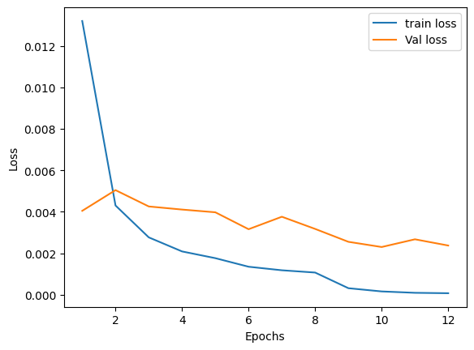

# character-classification

## Overview

The goal of this project was to develop a classification app for hand-drawn characters of the Cyrillic, Hiragana and Katakana alphabets. 

I trained CNNs with and without data augmentation for the various characters considered acheiving around 97-99\% validation accuracy.
I then built a streamlit app allowing a user to practice drawing various characters with the CNN giving a prediction for the top 3 most likely characters 
drawn. The streamlit app can be tested here:

The corresponding github repo is:

The main code used for the trainings can be found in the notebooks:
Cyrillic\_pytorch.ipynb
Cyrillic\_pytorch\_aug.ipynb
Japanese\_pytorch.ipynb
Katakana\_pytorch.ipynb

## Motivation

The motivation for this project came from the fact that I personally spent some time learning these alphabets given my passion for languages. In particular I have learnt Russian up to upper intermediate which uses the cyrillic alphabet and can write and read with this alphabet well. Meanwhile, as I work on an experiment based in Japan I learnt some basic Japanese including learning the Katakana and Hiragana alphabets of Japanese. 

## Data

The dataset for hand-drawn cyrillic letters was taken from https://github.com/bolattleubayev/cmnist, which consists of around 121,234 samples of 42 Cyrillic letters. I only used capitalized and none capitalized cyrillic letters from the Russian alphabet.

  

For Japanese I utilized data from the ETL character database for both Hiragana and Katakana alphabets. In order to read the data I used the tool on github, which I highly recommend, https://github.com/CaptainDario/ETLCDB_data_reader

I used datasets consisting of X Hiragana and Y Katakana characters, which were each of size 64x64. Below I visualize samples of the Hiragana:

  

and Katakana datasets

  

## Data processing and loading

For processing the datasets I tried two approachs.
* **no data augmentation** - here the data was resized with Pillow to 64x64, converted to numpy arrays and the images were normalized by 255. Next the tensor data loader of pytorch was used.
* **with data augmentation** - here the image files were stored in folders for train, test, validation and each class label. This allows the image folder data loader of pytorch to be used. In addition data augmentation transformations such as random rotations and tranlations were included. 

The idea of using data augmentation during the training is to make the CNN more robust to variations like rotations and translation given app input could vary. 
## Training CNN

The final CNN model architecture is summarised below:

  

I kept the model fairly simple due to small available datasets. Another approach would be to use transfer learning with a more complicated model.

Dropout is used for regularization. For training I used a batch size of 32 and the adam optimizer with a learning rate of 0.001. I generally found it was worth attempting to
drop the learning rate by an order of magnitude when the validation loss / accuracy began to plateau. 

## Results

| Alphabet           | Train Accuracy  | Validation Accuracy |
| -----------        | --------------- |---------------------|
| Cyrillic (caps)    |                 |                     |
| Cyrillic (no caps) |                 |                     |
| Hiragana           |                 |                     |
| Katakana           |                 |                     |

Below the loss and accuracy are shown for a cyrillic letter training for train and validation.

  
  

The confusion matrix shows a very low amount of examples incorrectly predicted.

  

## Exploration of GANs and Siamese networks 

For cyrillic letters I also explored implementing a GAN for cyrillic letters in the notebook Cyrillic\_pytorch.ipynb. An example of GAN generated letters is shown below for the letter б.

  

Meanwhile, I investigated the idea of employing a siamese networks to check if a letter drawn was close to a reference letter in Cyrillic\_siamese.ipynb. 

  

